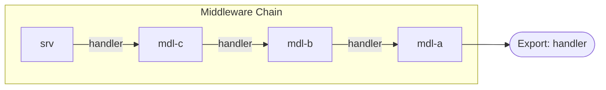

# cviz

A CLI tool to visualize WebAssembly component composition structure.

cviz parses composed WebAssembly components and generates diagrams showing how component instances are wired together. It's particularly useful for understanding middleware chains in WASI HTTP components.

## Installation

```bash
# From source
cargo install --path .

# Or from git
cargo install --git https://github.com/cosmonic-labs/cviz
```

## Usage

```
cviz [OPTIONS] <FILE>

Arguments:
  <FILE>  Path to the .wasm component file

Options:
  -f, --format <FORMAT>        Output format [default: ascii] [values: ascii, mermaid]
  -d, --direction <DIRECTION>  Diagram direction (mermaid only) [default: lr] [values: lr, td]
  -l, --detail <DETAIL>        Detail level [default: handler-chain]
  -o, --output <OUTPUT>        Output file (stdout if not specified)
  -h, --help                   Print help
  -V, --version                Print version
```

## Output Formats

### ASCII (default)

Clean terminal-friendly box diagrams:

```bash
cviz composed.wasm
```

```
┌────────────────────────────────────┐
│          Middleware Chain          │
├────────────────────────────────────┤
│srv ──handler──> mdl-c              │
│mdl-c ──handler──> mdl-b            │
│mdl-b ──handler──> mdl-a            │
│mdl-a ──> [Export: handler]         │
└────────────────────────────────────┘
```

### Mermaid

Generate Mermaid diagrams for documentation or visualization tools:

```bash
cviz composed.wasm -f mermaid
```



## Detail Levels

### `handler-chain` (default)

Shows only the HTTP handler middleware chain - the path from the entry point through all middleware to the final handler export.

```bash
cviz composed.wasm -l handler-chain
```

### `all-interfaces`

Shows all interface connections between components, including host imports (WASI interfaces like filesystem, environment, etc.):

```bash
cviz composed.wasm -l all-interfaces
```

```
┌───────────────────┐
│   Host Imports    │
├───────────────────┤
│  {environment}    │
│  {exit}           │
│  {stderr}         │
│  {stdin}          │
│  {stdout}         │
│  {streams}        │
│  ...              │
└───────────────────┘

┌─────────────────────────┐
│   Component Instances   │
├─────────────────────────┤
│  [mdl-a]                │
│  [mdl-b]                │
│  [mdl-c]                │
│  [srv]                  │
└─────────────────────────┘

┌───────────────────────────────────────────┐
│                Connections                │
├───────────────────────────────────────────┤
│  [srv] ──handler──> [mdl-c]               │
│  [mdl-c] ──handler──> [mdl-b]             │
│  [mdl-b] ──handler──> [mdl-a]             │
│  {environment} -.environment.- [srv]      │
│  ...                                      │
└───────────────────────────────────────────┘
```

### `full`

Shows all instances (including synthetic ones) with full interface names and component indices:

```bash
cviz composed.wasm -l full
```

## How It Works

cviz uses [wasmparser](https://crates.io/crates/wasmparser) to parse the WebAssembly component model structure. It extracts:

1. **Component instances** - The instantiated components within the composition
2. **Interface connections** - How instances are wired together via their imports/exports
3. **Export chain** - What the composed component exports to the outside world

For WASI HTTP middleware compositions, it specifically traces the `wasi:http/handler` interface chain to show the request flow through middleware layers.
